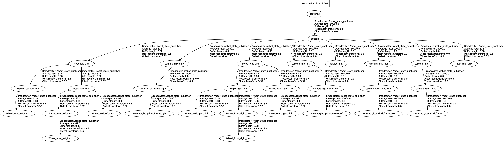
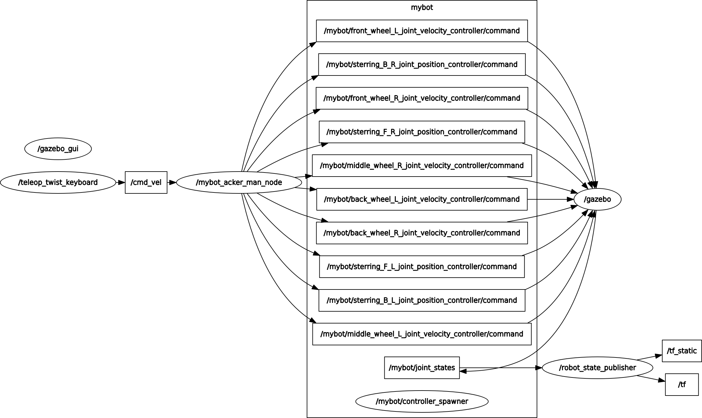

# 6-wheel vehicle model beetlebot_AIOZ with Rocker-bogie mechanism

Note: go to [BeetleBot/src/beetlebot_AIOZ](http://dev.ai.aioz.io/aioz-robotics/beetlebot/tree/master/src/beetlebot_AIOZ)  to read more description for system robot

## Run system:

    $ git clone http://13.228.73.8/aioz-robotics/beetlebot.git

    $ cd beetlebot

    $ catkin_make

    $ . devel/setup.bash

    $ roslaunch beetlebot_gazebo beetlebot_world.launch

    (Wait until the world finishes loading in the gazebo)

    $ roslaunch beetlebot_gazebo load_robot.launch
## Control robot with voice:
    $ git clone -b io http://13.228.73.8/aioz-robotics/product/product-team-workspace.git

    $ cd product-team-workspace/ros_ws

    $ catkin_make

    $ . devel/setup.bash

    $ roslaunch io_sensor io_microphone.launch

## Control robot with keyboard:

    $ cd catkin_ws
    $ . devel/setup.bash
    $ cd src/beetlebot_AIOZ/beetlebot_control/scripts
    $ python keyboard_controller.py

### Using keyboard to control robot

key| command|
---|---|
w|move forward
a| turn left|
d| turn right|
s| move backward|
space|stop
r| rotate delivery-robot clockwise
f| rotate delivery-robot counter-clockwise
i| increase velocity by 1
k| decrease velocity by 1
j| decrease turning radius by 10 or increase turning degree
l| increase turning radius by 10 or decrease turning degree

# Result for BeetleBot:

### TF_Tree

### rqt_graph

